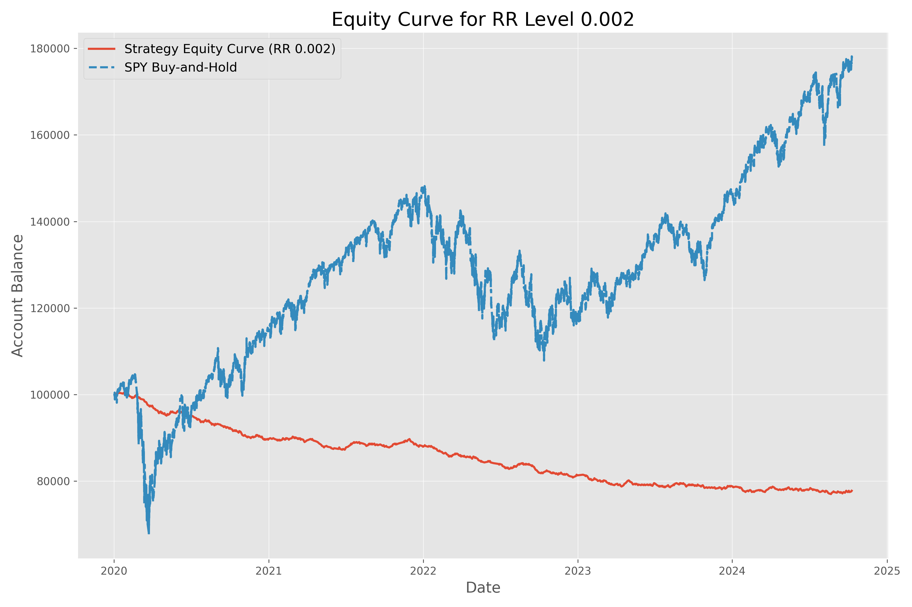
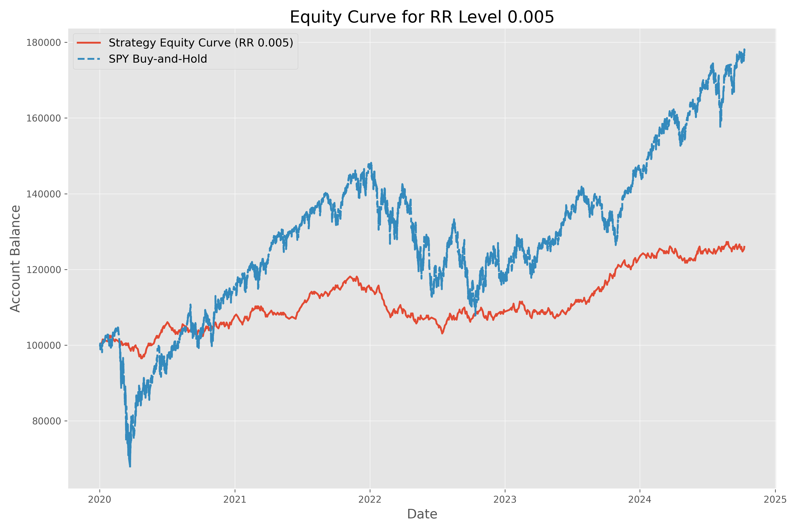
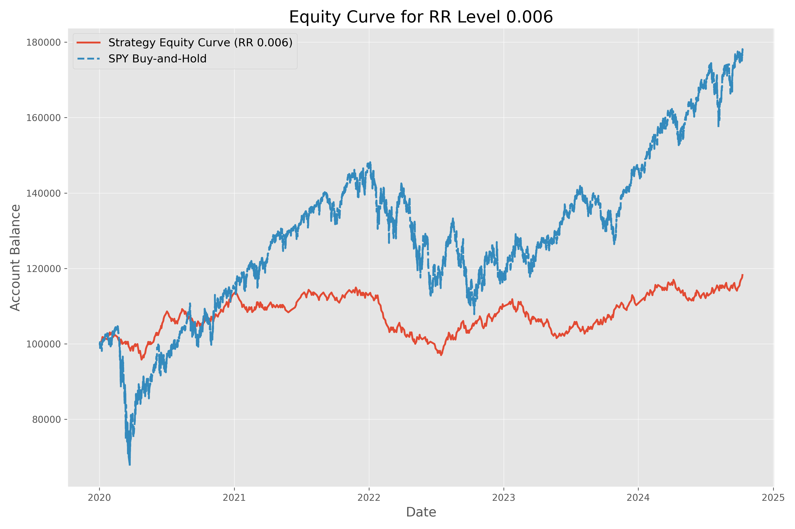
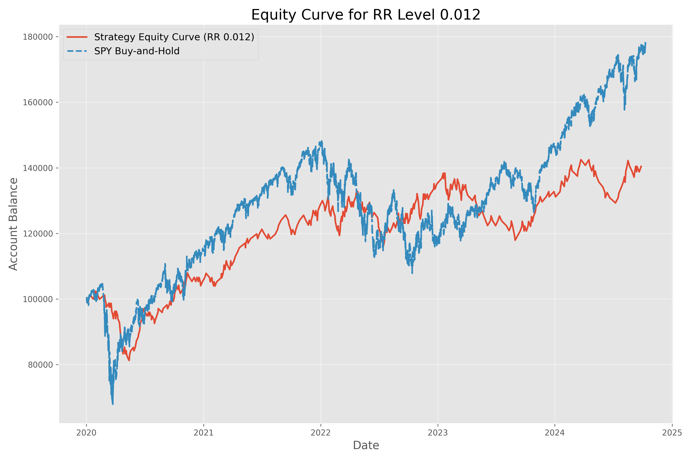
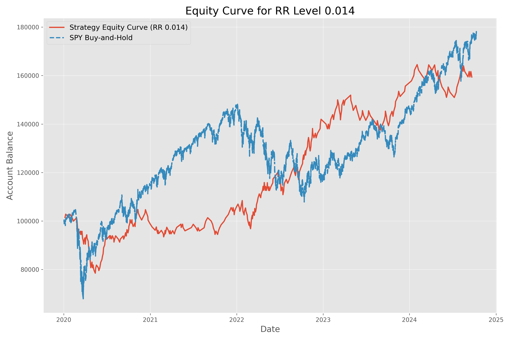
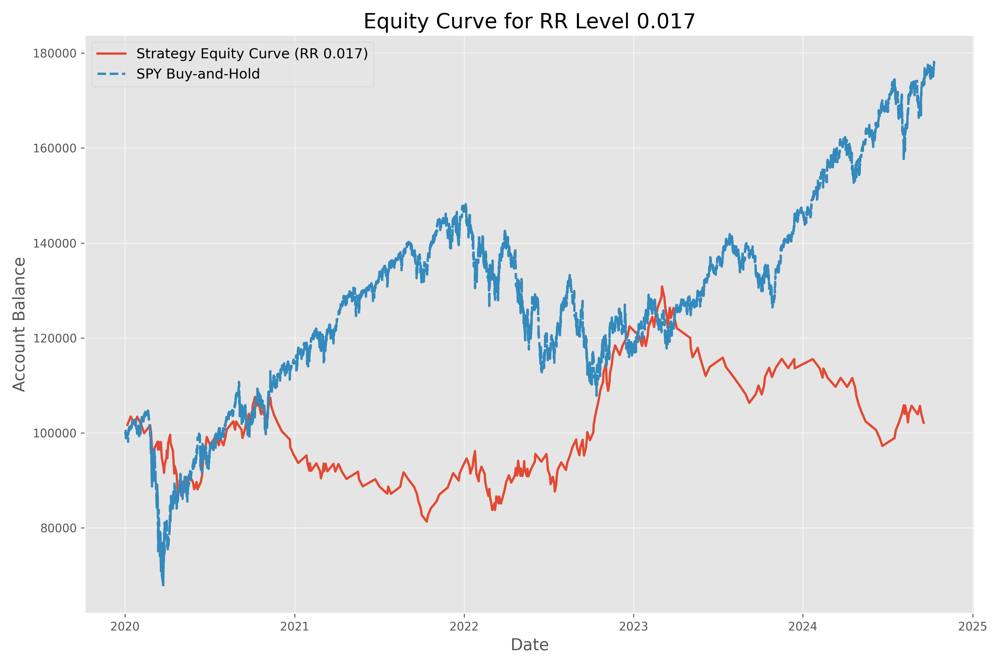
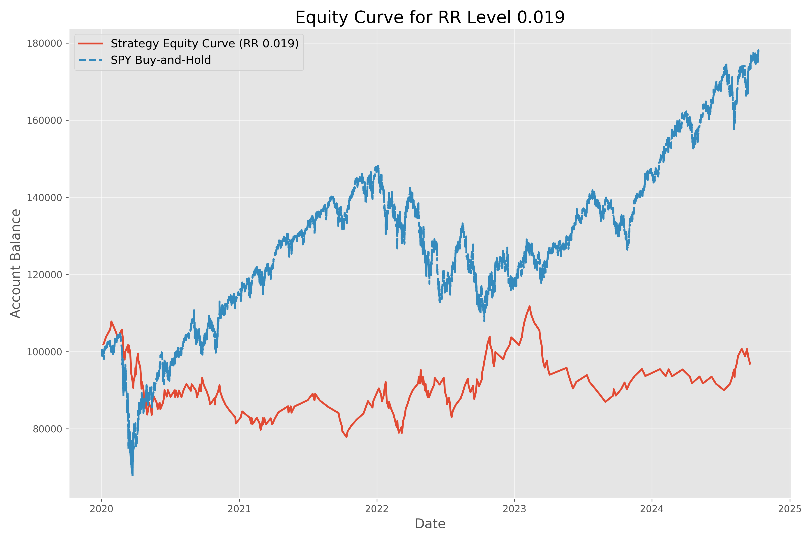

# ORB Backtest Repository

## Overview
This repository contains scripts and datasets for backtesting the Opening Range Breakout (ORB) strategy. It includes tools for data preparation, portfolio simulation, and results visualization. The repository is designed to handle large datasets efficiently using Git Large File Storage (LFS).

---

## Features
- **Data Resampling**: Convert raw 1-minute interval data into 15-minute and 5-minute intervals.
- **Portfolio Simulation**: Simulate trades based on risk-reward (RR) levels and generate equity curves.
- **Result Analysis**: Split backtest results by RR levels for detailed performance analysis.
- **Efficient Handling of Large Files**: Uses Git LFS for managing large datasets.

---

## Repository Structure
```
ORB_Strat/
├── Datasets/                # Contains resampled datasets and raw data files
├── Equity_Curve_Plots/      # Equity curve images generated by simulations
├── Portfolio_Sim_Results/   # Combined portfolio simulation results
├── RR_Level_Datasets/       # Backtest results split by RR levels
├── Backtest_Results/        # Aggregated backtest results
├── Scripts/                 # Python scripts for backtesting and data processing
│   ├── backtest.py                   # Main backtest script
│   ├── Portfolio_Sims.py             # Portfolio simulation
│   ├── Generate_Resampled_Datasets.py# Data resampling
│   ├── Split_Backtest_Results_File_By_RR_Level.py
└── README.md               # Project documentation
```

---

## Setup and Usage

### Prerequisites
1. Install [Python](https://www.python.org/) (version 3.8 or later).
2. Install required Python libraries:
   ```bash
   pip install -r requirements.txt
   ```
3. Install [Git LFS](https://git-lfs.github.com/) for managing large files.

### Step-by-Step Guide

#### Clone the Repository
```bash
git clone https://github.com/wuddup-02120/ORB-Backtest.git
cd ORB-Backtest
```

#### Set Up Git LFS
```bash
git lfs install
git lfs pull
```

#### Running the Scripts

1. **Resample Datasets**:
   ```bash
   python Scripts/Generate_Resampled_Datasets.py \
       --input_file Datasets/raw_data.csv \
       --output_dir Datasets/
   ```

2. **Run Backtest**:
   ```bash
   python Scripts/backtest.py \
       --file_15min Datasets/SPY_15min.csv \
       --file_5min Datasets/SPY_5min.csv \
       --file_1min Datasets/SPY_full_1min_UNADJUSTED.txt \
       --output_file Backtest_Results/backtest_results.csv
   ```

3. **Simulate Portfolios**:
   ```bash
   python Scripts/Portfolio_Sims.py \
       --input_directory Datasets/ \
       --output_directory Portfolio_Sim_Results/ \
       --equity_curve_directory Equity_Curve_Plots/
   ```

4. **Split Backtest Results by RR Levels**:
   ```bash
   python Scripts/Split_Backtest_Results_File_By_RR_Level.py \
       --results_file Backtest_Results/backtest_results.csv \
       --output_directory RR_Level_Datasets/
   ```

---

## Results Overview

## Simulation Results

Below is a screenshot of the portfolio simulation results:


### Equity Curve Plots
Below are the equity curve plots for different risk-reward levels:

#### RR Level 0.001


#### RR Level 0.002


#### RR Level 0.003


#### RR Level 0.004


#### RR Level 0.005


#### RR Level 0.006


#### RR Level 0.007


#### RR Level 0.008


#### RR Level 0.009


#### RR Level 0.010


#### RR Level 0.011


#### RR Level 0.012


#### RR Level 0.013


#### RR Level 0.014


#### RR Level 0.015


#### RR Level 0.016


#### RR Level 0.017


#### RR Level 0.018


#### RR Level 0.019


#### RR Level 0.020


---

## Example Workflow
1. Resample raw data into 15-minute and 5-minute intervals.
2. Run the backtest script on resampled data.
3. Analyze portfolio performance by generating equity curves.
4. Split results by RR levels for granular analysis.

---

## Contributing
Contributions are welcome! Please fork the repository, make changes, and submit a pull request.

---

## License
This project is licensed under the MIT License. See the LICENSE file for details.

---

## Support
For questions or support, please open an issue in the GitHub repository.
